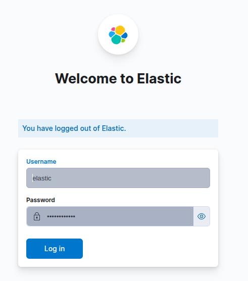

## Project
Elasticsearch, Kibana, NestJS, TypeORM, PostgreSQL, Redis, Docker, and Docker Compose.

# Run docker-compose first
```bash
docker-compose up -d
```
then run 
```bash
docker exec -it elasticsearch /bin/bash
```
and run this for reset password
```bash
bin/elasticsearch-reset-password -u kibana_system -b
```
then copy the password and paste it in the .env file variable KIBANA_SYSTEM_PASSWORD

